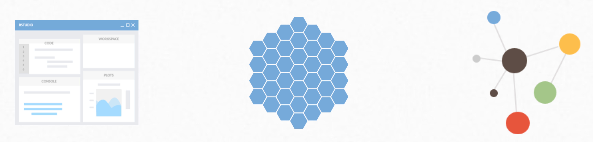

------------------------------------------------------------------------

------------------------------------------------------------------------

**Posit Team** is a modular platform consisting of Posit's professional software for scaling data science analytic work across your team, sharing data science results with your key stakeholders, and managing R and Python packages within your environment. Posit Team includes Posit Workbench, Posit Connect, and Posit Package Manager.

-   **Posit Workbench** is the development environment used to perform analyses and create data products using R or Python. Available editors include the RStudio IDE, Jupyter Notebooks, JupyterLab, and VS Code.

-   **Posit Connect** is the publishing platform used to internally host the data products your teams create in R and Python, connecting the data products you create to the end users who need to see them. Share Shiny, R Markdown, Plumber APIs, Jupyter Notebooks, Dash, Flask, Streamlit, Bokeh, and FastAPIs in one convenient place.

-   **Posit Package Manager** is used to organize and centralize R and Python packages across the enterprise for increased governance and reproducibility.

[***Learn more about RStudio in Life Sciences***](https://rstudio.com/solutions/pharma/)

------------------------------------------------------------------------

## Customer Webinars and Stories

-   [Scaling Data Science with R at **Janssen Pharmaceuticals**](https://rstudio.com/resources/webinars/scaling-data-science-with-r-at-janssen-pharmaceuticals/)

-   [RStudio/**Roche** Webinar: The Role of R in Drug Discovery, Research, and Development](https://rstudio.com/resources/webinars/the-role-of-r-in-drug-discovery-research-and-development/)

-   [FlatironKitchen: How we overhauled a Frankensteinian SQL workflow with the tidyverse - Nathaniel Phillips (**Roche**)](https://rstudio.com/resources/rstudioconf-2020/flatironkitchen-how-we-overhauled-a-frankensteinian-sql-workflow-with-the-tidyverse/)

-   [Cultivating an R-based Analytic Practice in Healthcare - Chris Bumgardner (**Children's Wisconsin**)](https://www.youtube.com/watch?v=pHZ8dsc0PhY)

[***See all RStudio webinars here***](https://www.rstudio.com/resources/webinars/)

------------------------------------------------------------------------

## Quick Resources for Users and Admin

| User Documentation                                                                                                                           | Admin Documentation                                                                                   |
|----------------------------------------------------------------------------------------------------------------------------------------------|-------------------------------------------------------------------------------------------------------|
| [RStudio Team End to End Demo](https://www.youtube.com/watch?v=VrF9EdgiSy8)                                                                  | [Scaling R & RStudio](https://support.rstudio.com/hc/en-us/articles/236226087-Scaling-R-and-RStudio/) |
| [RStudio Connect User Guide](https://docs.rstudio.com/connect/user/)                                                                         | [Reference Architectures](https://solutions.rstudio.com/production/architectures/)                    |
| [Using Python with RStudio](https://solutions.rstudio.com/python/overview/)                                                                  | [Reproducible Environments](https://environments.rstudio.com/)                                        |
| [Databases using R](https://db.rstudio.com/)                                                                                                 | [RStudio Solutions Site](https://solutions.rstudio.com/)                                              |
| [Managing Packages for Open Source Data Science](https://www.rstudio.com/resources/webinars/managing-packages-for-open-source-data-science/) | [All Documentation](https://docs.rstudio.com/)                                                        |

------------------------------------------------------------------------

[***Sign up for RStudio updates here***](https://www.rstudio.com/about/subscription-management/)

------------------------------------------------------------------------

## Connect With Your RStudio Account Team

Nichole Monhait, Sr. Account Executive: [nichole\@rstudio.com](mailto:nichole@rstudio.com){.email}
